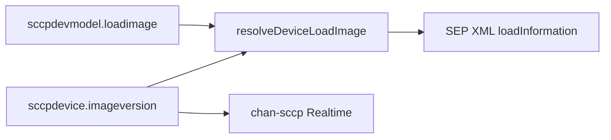

# Implementierungsplan: Firmware pro Telefon und Massen-Update

**Ziel:** Pro SCCP-Telefon eine Firmware-Version zuweisen (`sccpdevice.imageversion`), in `SEP{MAC}.cnf.xml` als `<loadInformation>` schreiben, Massen-Updates mit Restart via AMI.

**Stand:** Implementiert (02.07.2026)

---

## Implementierungsstatus

| Komponente | Datei | Status |
|------------|-------|--------|
| Service-Trait | `sccpManTraits/deviceFirmware.php` | Fertig |
| Trait-Einbindung | `Sccp_manager.class.php` | Fertig |
| XML-Override | `createSccpDeviceXML()` + `setLoadInformationValue()` | Fertig |
| AJAX `get_firmware_catalog`, `preview_firmware_assign`, `assign_firmware` | `sccpManTraits/ajaxHelper.php` | Fertig |
| Geräte-Formularfeld | `conf/sccpgeneral.xml.v433` | Fertig |
| Dynamisches Firmware-Dropdown | `assets/js/sccp_manager.js` | Fertig |
| Phone-Grid + Massen-Update-Modal | `views/hardware.phone.php` | Fertig |
| Phone-Grid Query | `sccpManClasses/dbinterface.class.php` | Fertig |

---

## Architektur

- **Feld:** bestehendes `imageversion` (leer/`NONE` = Modell-Standard aus `sccpdevmodel.loadimage`)
- **XML:** `resolveDeviceLoadImage()` setzt effektives `loadimage` vor `create_SEP_XML()`
- **Update:** XML regenerieren + `sccpDeviceReset(restart)` via AMI
- **Keine DB-Migration** nötig

---

## AJAX-API

| Command | Parameter | Rückgabe |
|---------|-----------|----------|
| `get_firmware_catalog` | `model` | `{catalog: {model, model_default, files[]}}` |
| `preview_firmware_assign` | `idn[]`, `firmware_map` (JSON) | Vorschau mit `rows[]`, `warnings[]` |
| `assign_firmware` | `idn[]`, `firmware_map` | Ergebnis pro Gerät, `table_reload: true` |

---

## UI

### Einzelgerät
- Dropdown **Firmware Version (Load Image)** in Gerätekonfiguration
- Option **Model default** + verfügbare TFTP-Dateien
- Validierungswarnung bei fehlender Firmware-Datei (Speichern bleibt möglich)

### Massen-Update
- Toolbar-Button **Assign Firmware** (bei Auswahl aktiviert)
- Wizard: Geräte → Firmware pro Modell → Vorschau → Zuweisen und Restart

### Phone-Grid
- Spalten: Assigned Firmware, Loaded Firmware, FW Status (ok/pending/offline)

---

## Testplan

1. Einzelgerät: `imageversion` setzen → `SEP{MAC}.cnf.xml` enthält Wert in `<loadInformation>`
2. Standard-Fallback: `NONE` → Modell-`loadimage`
3. Speichern löst Restart aus
4. Massen-Update für mehrere Geräte gleichen Typs
5. Gemischte Modelle: je Modell eigenes Dropdown
6. Grid zeigt zugewiesene vs. geladene Firmware

---

## Entscheidungen (bestätigt)

| Thema | Entscheidung |
|-------|--------------|
| DB-Feld | `imageversion` (bestehend) |
| Update-Auslösung | Restart via AMI |
| Addon-Firmware | weiterhin modellbasiert |
